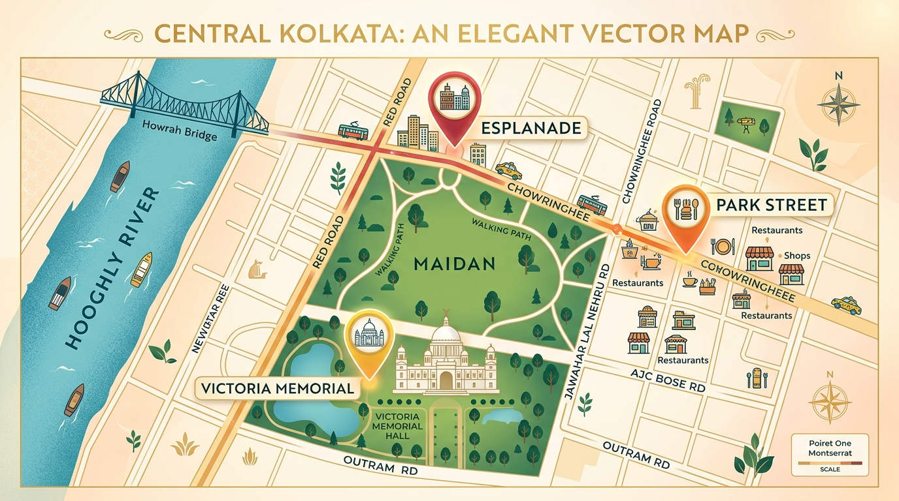
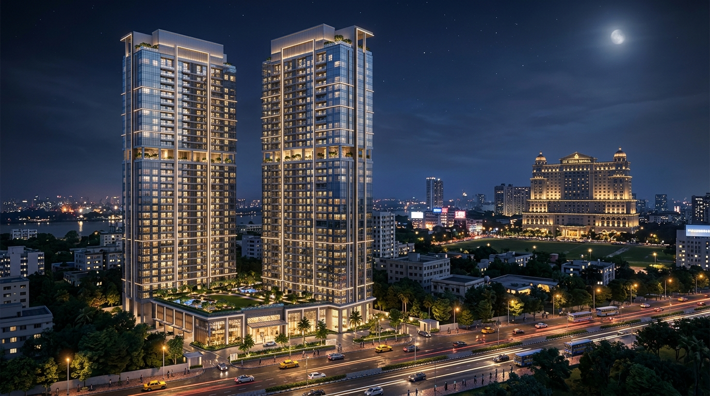
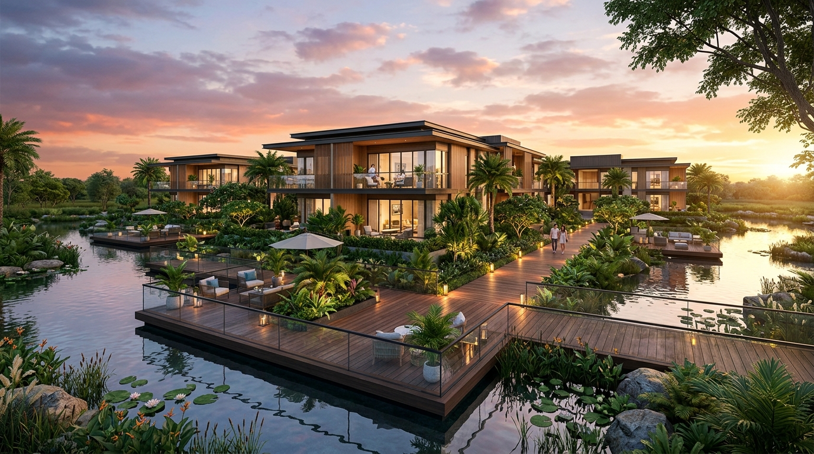
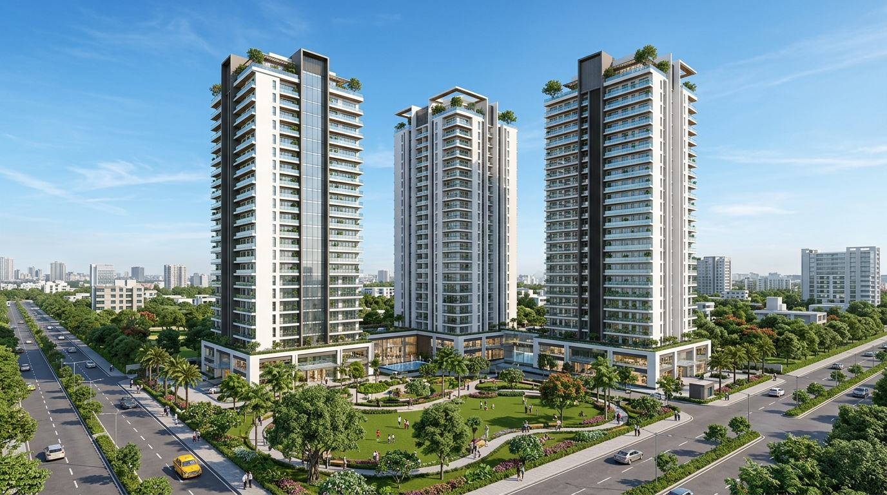
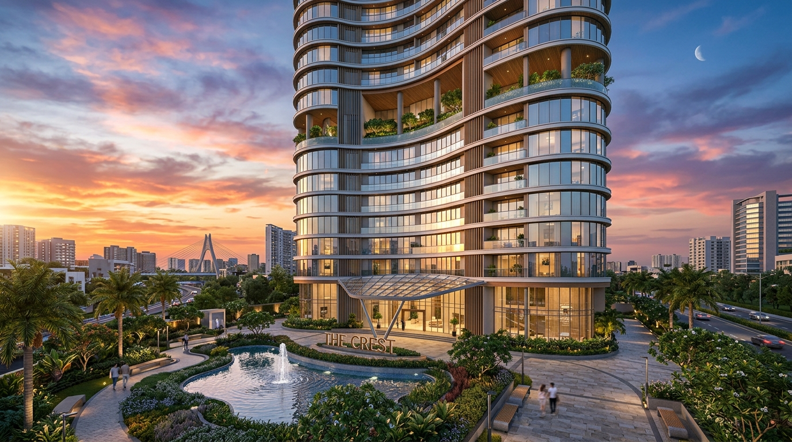
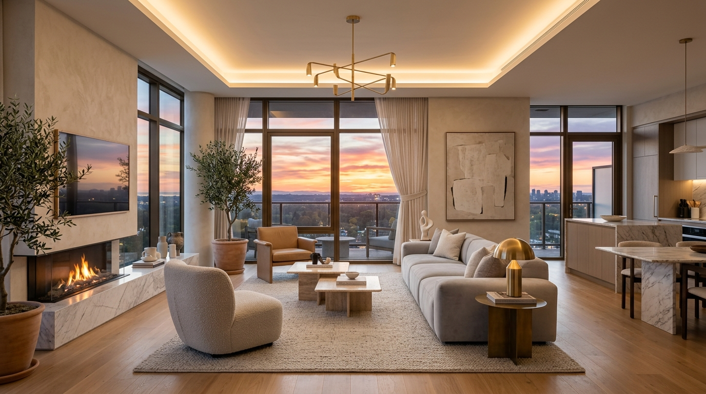
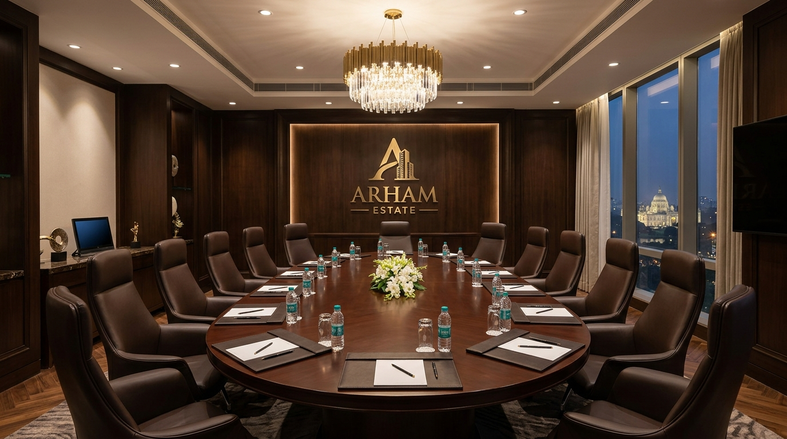

# Arham Estate — Luxury Real Estate Portal

A premium, highly interactive real estate web application built for **Arham Estate** in Kolkata, India. This project delivers a fluid, high-end editorial experience inspired by modern luxury architecture. It features a custom logo preloader, scroll-driven SVG animations, pinned presentation timelines, and a fully functional sitemap.

Built with **Next.js 16 (App Router)**, **TypeScript**, **GSAP (ScrollTrigger)**, **Lenis (Smooth Scroll)**, and **Vanilla CSS**.

---

## ✨ Design System & Brand Identity

The interface has been curated with a premium, high-contrast **light theme** designed for sophisticated audiences.

*   **Background ( Ivory/Alabaster )**: `#FAF9F6` — Clean, warm white that reduces eye strain and feels premium.
*   **Text ( Deep Slate Charcoal )**: `#0F172A` — Soft slate grey instead of harsh pure black for clean typography.
*   **Brand Highlight Green**: `#59A52C` — Represents growth, premium landscape design, and sustainability.
*   **Brand Accent Blue**: `#0BAADC` — Represents clarity, trust, and structural integrity.
*   **Typography**:
    *   *Headings*: **Outfit** (Modern, bold geometric sans-serif).
    *   *Body Copy*: **Inter** (Clean, highly legible neutral sans-serif).

---

## 🏗️ Technical Architecture & Sitemap

The application comprises 10 custom pages and dynamic routes:

1.  **Home Page (`/`)**: Features the custom logo preloader, spotlight hero banner, pinned philosophy presentation, about segment, featured properties slider, and contact forms.
2.  **About Us (`/about`)**: Narrative hero block, 4-pillar philosophy grid (Client First, Integrity, Insight, Impact), "Rooted in Kolkata" banner, chronological process timelines, and statistics counters.
3.  **Services (`/services`)**: "Advisory that creates value" hero block, 6-card comprehensive services grid, advantage stack list, and process pipelines.
4.  **Properties Directory (`/properties`)**: Active filters panel (Location, Property Type, Budget, Status), detailed property grid, and expert requirement matching.
5.  **Property Details (`/properties/[slug]`)**: Dynamic parameters resolved using React's modern `use()` hook. Displays local breadcrumbs, details row, gallery, and a direct advisor callback form.
6.  **Property Finder (`/property-finder`)**: Interactive requirements panel (Location, Type, Budget, Configuration, Purpose dropdowns), preferences checklist, amenities tag selector, and matches results checker.
7.  **Insights / Blog (`/insights`)**: Category tabs, large featured article card (*"Kolkata Real Estate Market Outlook 2024"*), sidebar recent articles list, popular cards showing reading times, and newsletter subscribe box.
8.  **Contact Us (`/contact`)**: Split forms for email messages, head office details with business hours, and office location cards.
9.  **Enquire Now (`/enquire`)**: Detailed requirement questionnaire card, "I am looking for" visual option cards, possession timelines, and what happens next timeline widgets.
10. **Careers (`/careers`)**: Values grid, "Why Join" section, open jobs accordion cards (Real Estate Consultant, Investment Analyst, etc.) with Apply actions, benefits checklist, and resume submit card.

---

## 🖼️ Media & Asset Registry

All high-quality visual renderings are stored in `public/images/` and rendered inside the app:

### 🌆 Landmarks & Location Map
| Howrah Bridge Sunset | Hooghly Bridge Sunset | Victoria Memorial |
|:---:|:---:|:---:|
|  |  |  |

| Central Kolkata Map | Classical Head Office Facade |
|:---:|:---:|
|  |  |

### 🏢 Properties & Architecture
| Aurus Towers | Jiva Waterfront | Panache New Town | The 102 Rajarhat |
|:---:|:---:|:---:|:---:|
|  |  |  |  |

### 🛋️ Luxury Lifestyles & Interiors
| Luxury Penthouse Living Room | Corporate Boardroom |
|:---:|:---:|
|  |  |

---

## 🚀 Getting Started & Execution

First, clone the repository and install the dependencies:

```bash
npm install
```

Run the development server:

```bash
npm run dev
```

Open [http://localhost:3000](http://localhost:3000) with your browser to see the result.

### Production Build

To verify compilation and optimize assets:

```bash
npm run build
npm run start
```
